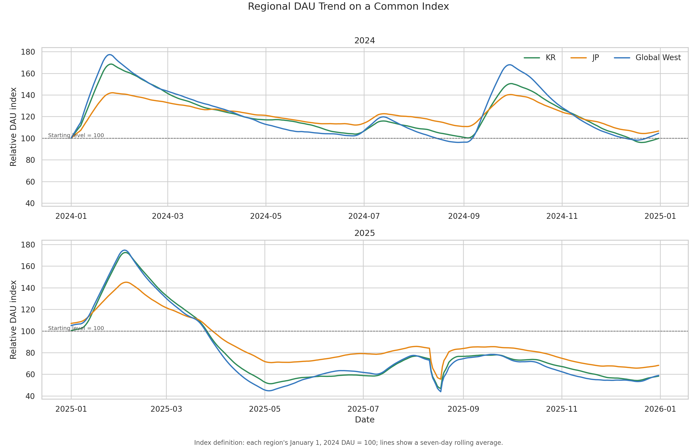
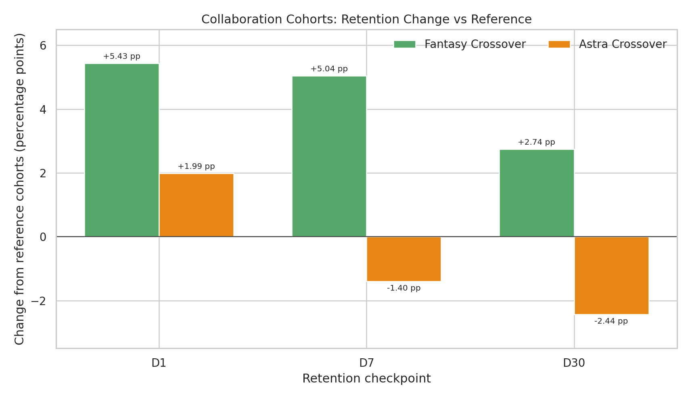
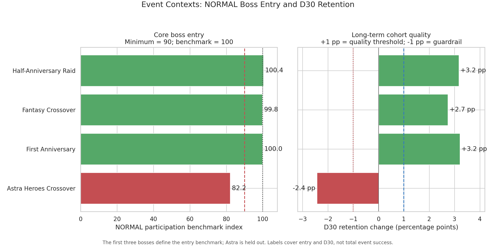
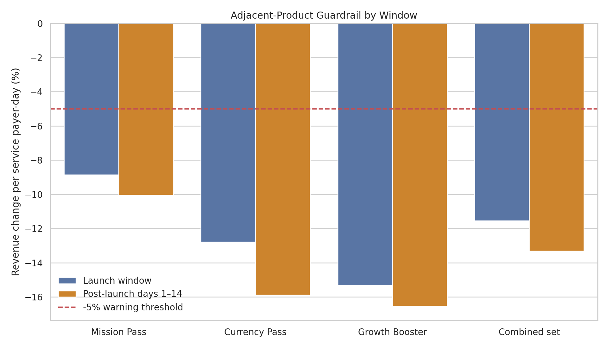
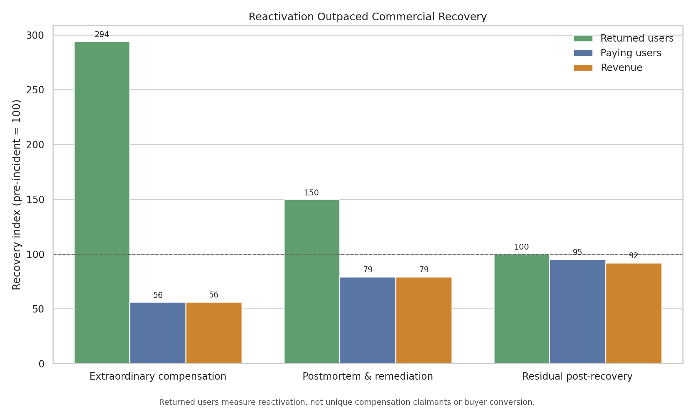
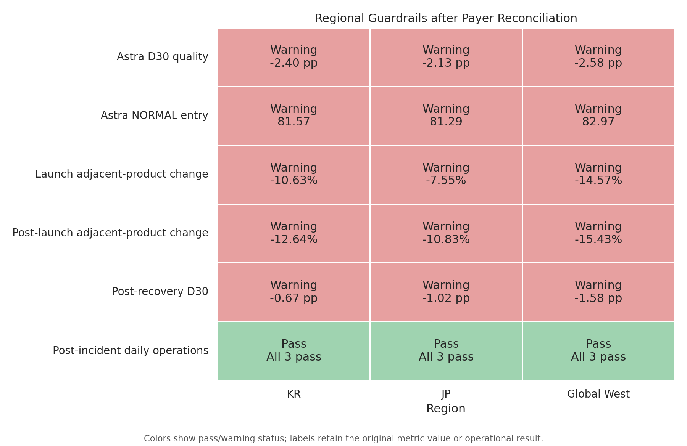
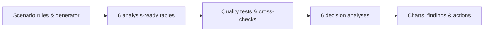

# Synthetic Global Collectible RPG Analytics

[한국어 요약 (Korean Summary)](README_KR.md)

An end-to-end analytics portfolio project following the first two years of a
fictional **character-collection, turn-based mobile player-versus-environment
(PvE) RPG** across South Korea (KR), Japan (JP), and a fictional Global West
region.

The project combines a **data-analysis-led narrative (approximately 70%)**
with **analytics-engineering practices (approximately 30%)**. It turns business
questions into a reproducible workflow: synthetic data generation, clearly
defined table grain (what each row represents), cross-checked metrics, and
automated tests.

| Scope | Definition |
|---|---|
| Observation period | 2024-01-01 to 2025-12-31 |
| Public datasets | 6 tables, 27,351 synthetic rows |
| Core themes | lifecycle, retention, PvE content, monetization, incident recovery, regional strategy |
| Tools and methods | Python, pandas, NumPy, Matplotlib, Seaborn, unit testing |

## Data Provenance and Confidentiality

> **Domain-informed, not production-data-derived.**

The business questions, KPI relationships, and operational scenarios reflect
the author's live-service game operations experience. However, every record,
value, event name, product, and timeline was independently designed and
deterministically generated for this project.

No proprietary dataset was copied, transformed, anonymized, or used to
calibrate the published data. The repository contains no real player data,
company schema, company identifier, or actual service incident.

See [Scenario and Synthetic Data Design](docs/scenario_design.md) for the full
design rationale and fictional service timeline.

## Quick Overview

The analysis treats the service as one connected lifecycle rather than a set of
isolated dashboards:

1. **Event durability:** Did major events create lasting player activity or
   only temporary traffic?
2. **Acquisition quality:** Why did two well-known collaborations attract
   players with different long-term retention?
3. **Core-content alignment:** Did event traffic reach the featured PvE boss,
   and where did the observed player journey break?
4. **Subscription value:** Did the new PvE-focused subscription generate
   additional spending or shift spending away from existing offers?
5. **Recovery completeness:** Did players returning after an outage also mean
   that revenue and retention had recovered?
6. **Global versus regional response:** Which problems required one shared
   response, and which needed different regional priorities?

Before evaluating an outcome, the analysis defines its comparison baseline,
the threshold for a meaningful change, the period used to judge whether the
change lasted, and the warning conditions. `Successful`, `Mixed`, and
`Underperforming` labels are assigned only to outcomes covered by all required
checks.

## Selected Findings

- **Event durability — The anniversary remained elevated against a strong
  holiday baseline, while the event calendar expanded.** Planned live-service
  events covered 17.5% of 2024 calendar days and generated 33.3% of annual
  revenue. In 2025, those shares rose to 31.0% of days and 54.5% of revenue,
  while the revenue-share/day-share ratio declined from 1.90× to 1.76×. The
  First Anniversary increased daily active users (DAU) by 34.7% relative to its
  holiday baseline and remained 49.9% above that reference afterward. This
  supports contextual persistence relative to an elevated reference, not an
  isolated anniversary-effect estimate.
- **Collaboration quality — Attracting more players did not mean that more of
  them stayed.** Players acquired during the Fantasy collaboration formed a
  79.2% larger cohort than the reference and improved 30-day retention (D30) by
  2.74 percentage points. Astra produced a 50.1% larger cohort, but its D30 was
  2.44 percentage points lower. The same volume-quality trade-off appeared in
  all three regions.
- **Core-content entry — Too few players reached Astra's boss fight.** The
  share of daily active users recorded as participants reached only 82.2% of
  the usual standard-difficulty level.
  Those who entered cleared it at normal rates and required a similar number
  of attempts, placing the observed break before combat rather than within the
  boss fight itself.
- **Subscription value — Revenue grew, but adjacent offers weakened after the
  launch.** Daily revenue rose 72.2% and paying users rose 44.2% versus
  the 30-day local baseline, but the new subscription accounted for only 25.5%
  of the observed revenue increase. After accounting for the larger payer
  base, combined revenue from the three adjacent recurring offers per service
  payer-day fell 9.9% in the following 14 days. This creates a reallocation
  warning rather than proof that individual buyers switched products. The
  result was **Mixed**.
- **Incident recovery — Players returned before revenue and retention
  recovered.** The outage reduced all observable activity and commerce to
  zero. Compensation then raised returned users to 293.9% of baseline, while
  revenue reached only 56.2%. Daily operations eventually met their recovery
  thresholds, but 30-day retention remained 1.23 percentage points below its
  pre-incident reference. That retention comparison identifies an unresolved
  post-recovery gap; overlapping cohort contexts prevent treating it as an
  outage-only causal estimate.
- **Regional strategy — One global plan would overlook different local
  priorities.** KR's weakest post-recovery new-user acquisition signal called
  for an acquisition-recovery diagnostic, JP showed the earliest adjacent-offer
  warning around the subscription launch, and Global West needed stronger
  retention-quality checks before further acquisition growth.

These are descriptive results from an authored synthetic scenario, not causal
estimates or industry benchmarks.

## Visual Decision Summary

The README shows one decision chart from each analysis. The linked finding
documents contain the complete evidence set, comparison rules, and limitations.

### 1. Lifecycle and Event Dependence



Each regional series is indexed to its own DAU on January 1, 2024, where
**100 represents that starting level**. The plotted values use a seven-day
rolling average. This makes relative changes comparable without implying that
the three regions have the same absolute DAU.
[Read Analysis 1 findings](docs/findings/analysis_01_lifecycle.md).

### 2. Acquisition Quality and Retention



Fantasy expanded its acquisition cohort and improved retention at D1, D7, and
D30. Astra also attracted more players and improved D1, but its D7 and D30
retention rates fell below their reference cohorts.
[Read Analysis 2 findings](docs/findings/analysis_02_retention.md).

### 3. Event-to-Core-PvE Alignment



> **Key diagnostic:** Astra attracted players, but too few reached the featured
> boss. Players who entered performed normally, placing the observed break
> before combat rather than within the boss difficulty itself.

[Read Analysis 3 findings](docs/findings/analysis_03_pve.md).

### 4. Revenue Growth and Subscription Value



The launch coincided with revenue and paying-user growth, but revenue from every
existing recurring offer crossed the -5% warning line during the following
14 days. Aggregate sales cannot determine whether the same buyers switched
products, so this is treated as a portfolio warning rather than proven
cannibalization.
[Read Analysis 4 findings](docs/findings/analysis_04_monetization.md).

### 5. Incident and Recovery



Compensation brought users back much faster than it restored paying users or
revenue. Even after daily operations normalized, 30-day retention remained
below its pre-incident reference. The cohort comparison is a recovery-quality
check, not an outage-only causal estimate.
[Read Analysis 5 findings](docs/findings/analysis_05_incident.md).

### 6. Overall Findings and Recommendations



Some risks were shared across all three regions, but local priorities still
differed. In particular, JP's immediate adjacent-product warning after the
subscription launch is treated as a local issue rather than being averaged into
a single regional score. Aggregate sales do not prove buyer-level switching.
[Read Analysis 6 findings](docs/findings/analysis_06_regional_strategy.md).

## Overall Conclusion

The service can generate attention, traffic, and revenue, but repeatedly loses
value at three handoffs: **campaign awareness to core-content entry, new-product
growth to adjacent-offer stability, and technical restoration to cohort
recovery**.

The recommended order is to add shared player-level diagnostics and guardrails
first, then act on the evidence by region: investigate qualified acquisition
and onboarding in KR, clarify recurring-offer positioning in JP, and apply
retention-durability gates before scaling acquisition further in Global West.
This sequence keeps the first response measurable and reversible instead of
jumping directly to difficulty changes, product removal, or more acquisition
spend.

## Data and Reproducibility

| Dataset | What one row represents (grain) | Rows |
|---|---|---:|
| `daily_kpis.csv` | date × region | 2,193 |
| `retention_cohorts.csv` | cohort month with a complete D30 window × region | 69 |
| `events.csv` | event × applicable region | 54 |
| `products.csv` | product | 12 |
| `daily_product_sales.csv` | date × region × product | 24,285 |
| `boss_event_metrics.csv` | date × region × boss × difficulty | 738 |



The pipeline checks that every table is complete, internally consistent, and
safe to analyze. The final suite contains **64 automated tests**.

<details>
<summary><strong>Technical validation coverage</strong></summary>

The tests cover complete table grains, non-negative KPIs, the rule that paying
users never exceed DAU (`PU ≤ DAU`), retention and boss-funnel hierarchies,
list-price revenue, daily revenue reconciliation, event-only product
availability, overlapping comparison windows, incomplete observation periods,
launch-window reconciliation, revenue decomposition, monetization warning
conditions, incident-stage boundaries, and recovery thresholds.

</details>

```bash
pip install -r requirements.txt
python src/generate_synthetic_data.py
python src/analyze_game_data.py
python src/analyze_lifecycle.py
python src/analyze_retention.py
python src/analyze_pve.py
python src/analyze_monetization.py
python src/analyze_incident.py
python src/analyze_regional.py
python -m unittest discover -s tests -v
```

Generated analysis tables are written to the Git-ignored `outputs/` directory.

## Documentation

- [Scenario and Synthetic Data Design](docs/scenario_design.md)
- [Analysis Specification](docs/analysis_spec.md)
- [Data Dictionary](docs/data_dictionary.md)
- [Analysis 1 Findings](docs/findings/analysis_01_lifecycle.md)
- [Analysis 2 Findings](docs/findings/analysis_02_retention.md)
- [Analysis 3 Findings](docs/findings/analysis_03_pve.md)
- [Analysis 4 Findings](docs/findings/analysis_04_monetization.md)
- [Analysis 5 Findings](docs/findings/analysis_05_incident.md)
- [Analysis 6 Findings](docs/findings/analysis_06_regional_strategy.md)
- [Executable Notebook](notebooks/game_user_behavior_analysis.ipynb)

## Limitations

- Scenario effects are authored assumptions, not estimated industry benchmarks.
- Aggregated synthetic data cannot establish causal effects.
- No user-level transactions, gacha pulls, character ownership, sentiment, or
  individual combat logs are included.
- Gross synthetic USD excludes taxes, refunds, and platform fees.
- Trust is not directly measured; retention and payer behavior are only
  behavioral proxies.
- D30 cohorts are published only through November 2025 because the December
  cohort is not mature within the observation window.

## Author

Han Sangwoo  
Live-Service Game Operations → Data Analytics / Analytics Engineering
