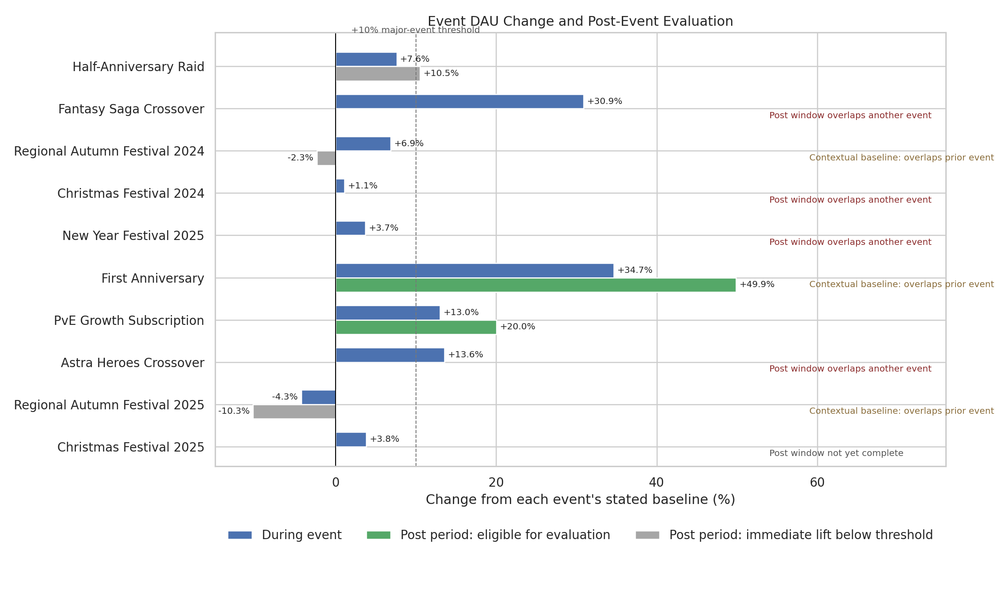
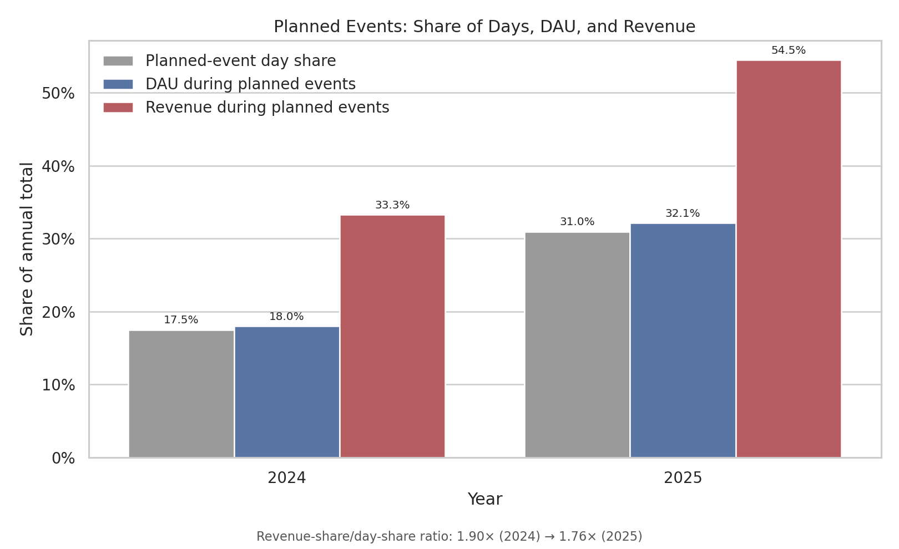

# Analysis 1: Service Lifecycle and Event Dependence

Scope: 2024-01-01 to 2025-12-31

## Quick Summary

> The First Anniversary produced a large, persistent DAU increase relative to
> an already elevated holiday baseline. Planned events also accounted for an
> increasing share of annual revenue, although their relative revenue density
> declined as the event calendar expanded.

## What This Analysis Answers

1. Which events produced a meaningful immediate increase in daily active users
   (DAU)?
2. Did that increase remain after the event ended?
3. How much of annual DAU and revenue occurred during planned event windows?
4. Which comparisons are too entangled with another event to support a clean
   conclusion?

> **Analysis boundary:** Analysis 1 evaluates traffic and time-based durability.
> It does not finalize collaboration quality, subscription value, or incident
> recovery; those decisions require retention, product, and recovery checks in
> later analyses.

## Method at a Glance

| Rule | How it is applied |
|---|---|
| Standard baseline | The 14 calendar days immediately before an event |
| Immediate change | Event-period performance versus its stated baseline |
| Meaningful lift | Must exceed both ordinary baseline variation and the practical threshold |
| DAU threshold | +10% for major events and subscription traffic; +5% for seasonal events |
| Durability | Evaluated only after immediate DAU clears the materiality threshold; days 1–14 must retain at least 30% of that lift |
| Post-window overlap | The observed value is reported, but durability is not attributed to one event |
| Baseline overlap | A material lift followed by a clean post-window may be labeled contextual persistence; otherwise the result remains a contextual comparison only |
| Regional aggregation | Counts are summed; rates are recalculated from their summed components |

Complete hypotheses, formulas, and thresholds are documented in the
[Analysis Specification](../analysis_spec.md).

## 1. Regional DAU Trend on a Common Index

### At a Glance

Each region's January 1, 2024 DAU is set to 100. A value of 150 means that the
region's seven-day average DAU is 50% above its own starting level; it does not
mean 150 users. This common scale compares relative movement without allowing
the largest market to dominate the chart.

### Finding

All three regions follow the same broad lifecycle: early growth, decline,
anniversary peaks, a 2025 content gap, partial recovery, and a synchronized
outage trough. Their direction is similar, but the size of each movement is
not. Global West reacts most sharply to major content cadence, while JP follows
a steadier path.

### Decision Relevance

The shared direction supports one global lifecycle narrative. The different
amplitudes show why regional behavior should still be analyzed separately
rather than treating KR, JP, and Global West as scaled copies of one market.

The daily table records zero DAU on the August 12 outage. The chart does not
reach zero because it intentionally displays a seven-day rolling average.

## 2. Event Lift and Durability

### At a Glance

Blue bars show DAU change during each event. Green post-period bars are eligible
for a durability evaluation. Grey post-period bars are shown for context, but
the immediate DAU change did not clear the materiality threshold. A missing
post-period bar with an overlap or incomplete note means that durability cannot
be evaluated independently. The dashed +10% line is the major-event threshold;
seasonal events use +5%.

| Event | During event | Observed post 1–14 days | What this analysis can conclude | Important context |
|---|---:|---:|---|---|
| Half-Anniversary Raid | +7.6% | +10.5% | Directionally positive, but not eligible for a durability classification | Immediate DAU is below the +10% materiality threshold |
| Fantasy Saga Crossover | +30.9% | +51.5%* | Strong immediate traffic; durability withheld | Post-period overlaps the autumn festival |
| Regional Autumn Festival 2024 | +6.9% | -2.3% | Contextual comparison only: immediate DAU did not clear baseline variability | Baseline includes the preceding crossover |
| First Anniversary | +34.7% | +49.9% | Contextual persistence: large relative increase against an elevated baseline | Baseline includes Christmas and New Year activity; the clean post-window supports persistence only relative to this reference |
| PvE Growth Subscription | +13.0% | +20.0% | Strong immediate traffic; durable traffic within this analysis | Final product value requires Analysis 4 checks |
| Astra Heroes Crossover | +13.6% | +6.4%* | Strong immediate traffic; durability withheld | Post-period contains the outage and restoration |
| Regional Autumn Festival 2025 | -4.3% | -10.3% | Contextual comparison only; no positive DAU lift | Baseline overlaps postmortem and recovery activity |
| Christmas Festival 2025 | +3.8% | Not observable | Below the seasonal threshold; durability unavailable | Observation ends on the event end date |

\* The value is descriptive only because another material event overlaps the
measurement window.

### What Is Established

- The First Anniversary cleared materiality against an already elevated holiday
  baseline and remained well above it in a clean post-window. This supports
  contextual persistence, not an isolated anniversary-effect estimate.
- The PvE subscription also passes the traffic and durability checks, but that
  does not establish whether its revenue was incremental.
- Both collaborations generated meaningful immediate traffic.
- Half-Anniversary activity remained directionally elevated afterward, but its
  +7.6% immediate DAU did not qualify for a durability classification.

### What Remains Unresolved

- Fantasy's post-period includes another event, so its +51.5% observed lift
  cannot be attributed solely to the collaboration.
- Astra's post-period includes the outage and recovery sequence, preventing an
  independent durability judgment.
- Higher service-level DAU does not prove that newly acquired players stayed.
  Analysis 2 must evaluate cohort retention.
- Persistent traffic after the subscription launch does not rule out spending
  shifting away from existing products. Analysis 4 tests that possibility.

## 3. Planned Event Dependence

### At a Glance

Grey bars show how much of the year was covered by planned events. Blue and red
bars show how much of annual DAU and revenue occurred during those same days.
A large gap between the grey and red bars indicates that revenue is more
concentrated in event windows than the calendar alone would suggest.

| Year | Planned-event day share | DAU during planned events | Revenue during planned events | Revenue-share/day-share ratio |
|---|---:|---:|---:|---:|
| 2024 | 17.5% | 18.0% | 33.3% | 1.90× |
| 2025 | 31.0% | 32.1% | 54.5% | 1.76× |

### Finding

DAU share remains close to the share of days occupied by planned events. By
contrast, revenue share is much higher: planned events cover 31.0% of 2025 but
contain 54.5% of annual revenue. The service therefore becomes more event-heavy
while monetization is more concentrated in those windows than audience size.

The two-year movement contains an important counter-signal. The
revenue-share/day-share ratio falls from 1.90× to 1.76×. Planned-event days
therefore occupy more of the calendar and contain more total annual revenue,
but each planned-event day is slightly less revenue-dense relative to the
average day than it was in 2024.

### Decision Relevance

Peak traffic alone is not enough to judge an event. The expanding event
footprint, combined with a lower relative revenue density, suggests that adding
more event days does not automatically preserve the intensity of each event
window. Planning should also track retained player quality, product
substitution, and performance between major events.

### Limitation

This is a concentration diagnostic, not a causal estimate. Events occur during
different seasonal and lifecycle conditions, so the analysis does not estimate
what revenue would have been if no event had taken place.

## Analysis 1: Decision and Next Step

Analysis 1 supports three conclusions: the First Anniversary remained strongly
elevated relative to its holiday baseline, both collaborations created
immediate traffic but lack clean durability windows, and the event calendar's
revenue footprint grew while relative revenue density per planned-event day
declined. Analysis 2 tests whether collaboration-driven acquisition also
produced players who remained active after 7 and 30 days.
