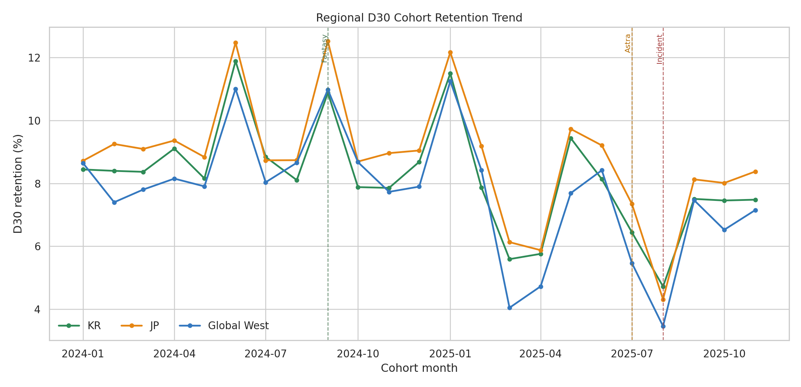
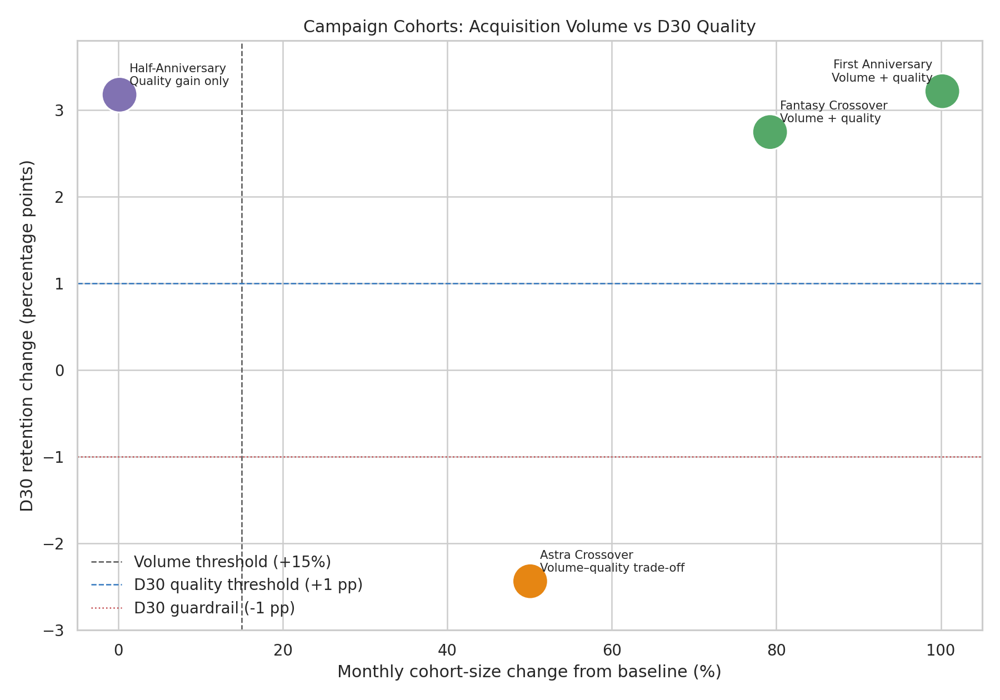

# Analysis 2: Acquisition Quality and Retention

Scope: January 2024 through November 2025

## Quick Summary

> Fantasy and Astra both expanded acquisition, but only Fantasy maintained
> retention quality. Astra improved D1 retention by 1.99 percentage points (pp),
> then fell below its reference cohorts at D7 and D30 across all three regions.

## What This Analysis Answers

1. Did larger acquisition cohorts also retain better after 30 days?
2. Which campaign-context cohorts improved both volume and long-term quality?
3. Did Fantasy and Astra follow different retention paths after their initial
   response?
4. Were the collaboration outcomes shared across regions or driven by one
   market?

> **Analysis boundary:** Retention is available at monthly-cohort level. The
> analysis compares cohort contexts; it does not identify event participants or
> estimate the isolated causal effect of a single campaign.

## Method at a Glance

| Rule | How it is applied |
|---|---|
| Cohort grain | Acquisition month × region |
| Regional aggregation | Retained-user counts are summed before rates are recalculated |
| Reference cohorts | Explicit recent months selected for each campaign context |
| Acquisition-volume threshold | Monthly cohort size must increase by at least 15% |
| D30 quality threshold | Must improve by at least the larger of +1.0 pp or ordinary reference-month variation |
| D30 quality guardrail | A decline of -1.0 pp or worse indicates material long-term deterioration |
| D30 retained-user gap | Observed D30 users minus expected D30 users at the target cohort size and reference retention rate |
| Mature horizon | December 2025 is excluded because its D30 observation is incomplete |

Complete formulas and decision thresholds are documented in the
[Analysis Specification](../analysis_spec.md).

## Comparison Contexts

| Campaign context | Target cohort | Reference cohorts | Attribution context |
|---|---|---|---|
| Half-Anniversary | June 2024 | March–May 2024 | The raid begins late in June and continues into July |
| Fantasy Crossover | September 2024 | July–August 2024 | The crossover and autumn festival share the target month |
| First Anniversary | January 2025 | October–December 2024 | New Year and anniversary activity share the target month |
| Astra Crossover | July 2025 | May–June 2025 | Reference months include the PvE subscription-launch context |

These are recent operational comparators, not untreated control groups. A
campaign name identifies the dominant target-month context, not a uniquely
attributed treatment effect.

The May–June reference for Astra overlaps the subscription launch, but its
pooled D30 retention of 8.52% is only 0.09 pp above the event-free February 2025
cohort and 0.19 pp above the event-free March–May 2024 reference. This does not
establish a materially elevated reference under the +1 pp quality threshold.
The overlap is therefore retained as attribution context rather than used to
apply a directional bias adjustment.

## 1. Regional D30 Retention Trend

### At a Glance

Each line shows the share of a region's monthly acquisition cohort still active
after 30 days. Vertical markers identify the cohort months containing Fantasy,
Astra, and the infrastructure incident. They mark context, not exact event-day
causality.

### Finding

JP generally maintains the highest D30 retention, while Global West varies more
sharply. The direction of the major movements is nevertheless shared: the
Fantasy-context cohort has high retention, the Astra-context cohort
deteriorates, and the August 2025 incident-context cohort reaches the lowest D30
point in every region.

Later cohorts improve from the incident trough but do not immediately return to
the stronger pre-gap or anniversary levels. Recovery is finalized in Analysis
5 rather than attributed here.

### Decision Relevance

The Fantasy improvement and Astra deterioration are not produced by a single
regional mix. A global campaign review is justified, while the different
regional levels still warrant local monitoring.

## 2. Acquisition Volume and D30 Quality

### At a Glance

The horizontal axis measures monthly cohort-size change; the vertical axis
measures D30 retention change. The upper-right area represents campaigns that
clear both the +15% volume threshold and the +1 pp quality threshold. The lower
right indicates acquisition growth accompanied by a long-term quality risk. A
point near the vertical axis indicates a quality change without meaningful
acquisition-volume growth.

| Campaign context | Cohort-size change | D30 change | D30 retained-user gap at target volume | Decision |
|---|---:|---:|---:|---|
| Half-Anniversary | +0.1% | +3.17 pp | +2,039 | Mixed: quality gain without volume lift |
| Fantasy Crossover | +79.2% | +2.74 pp | +3,010 | Successful |
| First Anniversary | +100.2% | +3.21 pp | +3,441 | Successful |
| Astra Crossover | +50.1% | -2.44 pp | -1,566 | Mixed: volume-quality trade-off |

### Finding

Fantasy and the First Anniversary clear both decision thresholds. The
Half-Anniversary improves long-term quality but does not expand the monthly
cohort, so it remains mixed. Astra increases cohort size by 50.1% but breaches
the D30 quality guardrail by 2.44 percentage points.

The Half-Anniversary result does not contradict Analysis 1. Its raid begins on
June 26, so a monthly acquisition cohort can remain nearly unchanged even when
daily activity rises during a short event window.

### How to Read the D30 Retained-User Gap

The gap isolates the arithmetic effect of retention quality at the target
cohort size; it is not the difference between two raw monthly user counts.

For Astra:

- the reference months averaged approximately 3,653 D30 retained users;
- the larger July cohort produced 3,915 D30 retained users, approximately 263
  more than the reference-month average; but
- maintaining the reference D30 rate at July's larger cohort size would have
  produced approximately 5,481 retained users.

The reported **-1,566** therefore means that Astra delivered 1,566 fewer D30
users than expected for its acquisition volume. It does not mean that the
service had 1,566 fewer retained users than an average reference month.

### Decision Relevance

Acquisition volume alone would label Astra positively. Combining volume with
D30 quality reveals that the campaign acquired more players without converting
that scale into proportionate long-term activity.

## 3. Collaboration Retention Path

### At a Glance

Bars show percentage-point change from each collaboration's own reference
cohorts. Values above zero indicate better retention; values below zero indicate
worse retention. This view makes the different post-acquisition paths visible
without requiring readers to compare absolute retention levels across D1, D7,
and D30.

| Collaboration context | Cohort-size change | D1 change | D7 change | D30 change | Regional D30 range | Decision |
|---|---:|---:|---:|---:|---:|---|
| Fantasy Crossover | +79.2% | +5.43 pp | +5.04 pp | +2.74 pp | +2.37 to +3.79 pp | Successful |
| Astra Crossover | +50.1% | +1.99 pp | -1.40 pp | -2.44 pp | -2.58 to -2.13 pp | Mixed: volume-quality trade-off |

### Finding

Fantasy improves at every checkpoint and in every region. Because the autumn
festival overlaps September, the finding applies to the combined target-month
context rather than the crossover alone.

Astra creates a positive initial response, but the direction reverses by D7 and
worsens by D30. Every region breaches the -1 pp D30 guardrail, ruling out a
one-region composition explanation in this dataset.

### Decision Relevance

The point of failure occurs after initial acquisition rather than at first-day
response. The available monthly data supports a retention-quality diagnosis but
cannot identify whether audience fit, onboarding, progression, content entry,
or another mechanism produced the decline.

## What Is Established

- Fantasy is a successful volume-and-quality cohort context, with an attribution
  caveat for the overlapping autumn event.
- Astra is a mixed volume-quality trade-off: acquisition and D1 improve, while
  D7 and D30 materially deteriorate.
- The Fantasy and Astra D30 directions are consistent across KR, JP, and Global
  West.
- Half-Anniversary quality improves without a meaningful monthly volume lift.
- First Anniversary clears both volume and long-term quality thresholds within
  its New Year and anniversary context.

## What Remains Unresolved

- Monthly cohorts cannot separate players acquired by one event from other
  players acquired during the same month.
- Aggregated retained-user counts cannot identify which user segments churned.
- Retention alone cannot distinguish audience mismatch, progression friction,
  weak reward communication, or perceived power requirements.
- The D30 retained-user decomposition is arithmetic, not a causal estimate of
  users created or lost by a campaign.

## Analysis 2: Decision and Next Step

Analysis 2 supports different provisional decisions for the two collaboration
contexts: Fantasy is **Successful**, while Astra is **Mixed: volume-quality
trade-off**. Analysis 3 tests whether Astra's retention deterioration coincides
with weak entry into its featured PvE boss and whether the break occurs before
or after players begin attempting the content.
