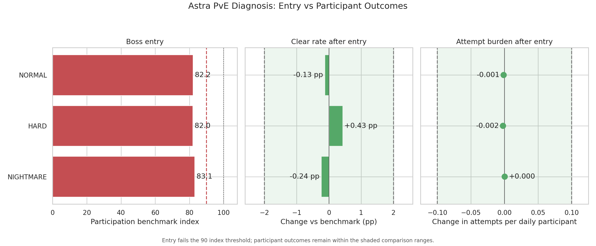
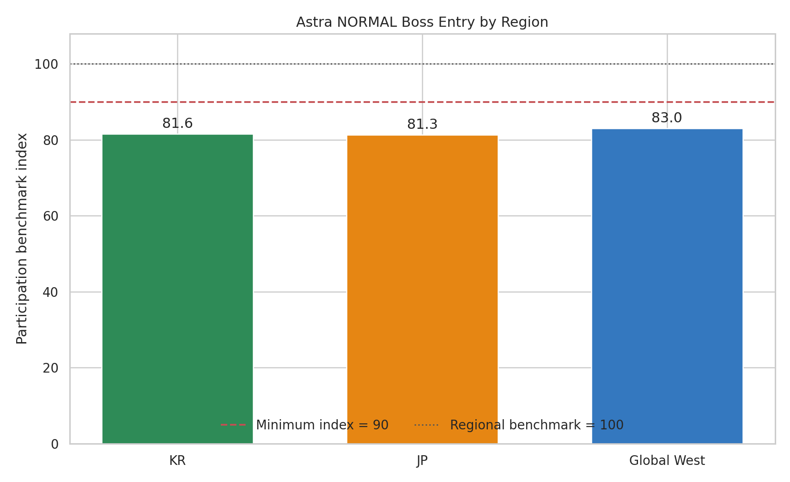

# Analysis 3: Core-Content Entry and PvE Engagement

Scope: four limited PvE bosses across KR, JP, and Global West

## Quick Summary

> Astra generated positive event traffic, but its featured boss reached only
> 82.2% of the usual standard (NORMAL) difficulty entry level. The shortfall
> appeared at every difficulty and in every region. Outcomes after entry stayed
> within the comparison ranges, pointing to a content-reach or entry problem
> rather than a demonstrated combat-difficulty failure.

## What This Analysis Answers

1. Did event traffic reach the featured core PvE content?
2. Was Astra's shortfall visible at entry, after entry, or both?
3. Did the same pattern appear across difficulties and regions?
4. Which operational responses are supported by the available evidence?

> **Analysis boundary:** The source contains daily aggregate counts, not
> player-level paths. Difficulty-level participants can overlap, and the same
> player can appear on multiple days. The analysis therefore compares separate
> difficulty-level entry and participant outcomes; it does not treat NORMAL,
> HARD, and NIGHTMARE as a sequential user funnel.

## Method at a Glance

| Rule | How it is applied |
|---|---|
| Source grain | Date × region × boss × difficulty |
| Entry measure | Sum of daily participants ÷ sum of DAU; NORMAL is the broadest available entry proxy |
| Reference benchmark | Pooled Celestial Wyrm, Crossover Demon Lord, and Anniversary Ancient One results, calculated separately by difficulty |
| Held-out comparison | Astra Void Beast is excluded from benchmark construction |
| Participation threshold | At least 90% of the comparable difficulty benchmark |
| Clear-rate comparison | Within ±2.0 percentage points (pp) of benchmark |
| Attempt-burden comparison | Within ±0.10 attempts per recorded daily participant of benchmark |
| Cohort-quality context | D30 +1 pp quality threshold and -1 pp deterioration guardrail from Analysis 2 |

These are authored portfolio decision thresholds, not mobile-game industry
benchmarks. The first three bosses define the descriptive reference; their
near-100 indices are not independent validation results. Astra is the only
held-out boss evaluated against that reference.

Complete formulas and decision thresholds are documented in the
[Analysis Specification](../analysis_spec.md).

## 1. Astra Entry and Participant Outcomes

### At a Glance

The left panel compares Astra's daily participation rate with the pooled
reference, where 100 is the reference level and 90 is the minimum threshold.
The other panels show changes in clear rate and attempts per daily participant
after entry. Their shaded areas mark the ranges treated as comparable.

| Difficulty | Astra daily participation | Reference | Entry index | Clear-rate change | Attempt change |
|---|---:|---:|---:|---:|---:|
| NORMAL | 18.11% | 22.04% | 82.17 | -0.13 pp | -0.001 |
| HARD | 9.00% | 10.98% | 81.99 | +0.43 pp | -0.002 |
| NIGHTMARE | 3.70% | 4.45% | 83.10 | -0.24 pp | +0.000 |

### Finding

Astra misses the entry threshold at every difficulty. In contrast, all three
clear-rate changes remain inside ±2 pp, and all attempt changes remain well
inside ±0.10. The measured shortfall therefore appears at content reach or
entry rather than in participant outcomes.

### Decision Relevance

A broad difficulty nerf is not the evidence-led first response. The
higher-priority review is the path into the boss: event exposure, boss
discovery, eligibility, progression readiness, reward communication, and the
first-attempt prompt.

This does not prove that the boss was easy or accessible to everyone. Similar
outcomes among participants can coexist with self-selection if less-prepared
players decide not to enter.

## 2. Regional Consistency

### At a Glance

Each bar compares Astra's NORMAL-difficulty entry with the same region's pooled
reference. A value of 100 matches the regional reference; 90 is the minimum
decision threshold.

| Region | Astra daily participation | Regional reference | Entry index |
|---|---:|---:|---:|
| KR | 17.97% | 22.03% | 81.57 |
| JP | 17.99% | 22.13% | 81.29 |
| Global West | 18.25% | 22.00% | 82.97 |

### Finding

Every region falls below the entry threshold, and the indices cluster between
81.3 and 83.0. The overall result is therefore not explained by one regional
mix in this dataset.

### Decision Relevance

The shared direction supports a service-wide entry-path review rather than a
single-market explanation. Regional monitoring should remain in place, but
the first diagnostic pass can use one common framework across all three
regions.

## 3. Event Context, Boss Entry, and D30 Retention

### At a Glance

The left panel shows NORMAL-difficulty boss entry; the right panel shows the
corresponding monthly cohort's D30 retention change from Analysis 2. The first
three boss rows construct the entry reference, while Astra is held out. The
result label covers boss entry and D30 quality only; it is not a total
event-success classification.

| Event context | Event DAU change | NORMAL entry index | D30 change | Entry-and-retention result |
|---|---:|---:|---:|---|
| Half-Anniversary | +7.63% | 100.39 | +3.17 pp | Entry and retention aligned |
| Fantasy Crossover | +30.91% | 99.82 | +2.74 pp | Entry and retention aligned |
| First Anniversary | +34.67% | 99.97 | +3.21 pp | Entry and retention aligned |
| Astra Crossover | +13.59% | 82.17 | -2.44 pp | Traffic-to-content disconnect |

### Finding

Fantasy combines material event traffic, reference-level boss entry, and
positive D30 quality. Astra also clears the Analysis 1 immediate-traffic
threshold, but its boss entry falls below 90 and its D30 change breaches the
-1 pp guardrail.

The comparison connects the Analysis 1 traffic result with the Analysis 2
cohort result. It does not establish that low boss entry caused lower
retention.

### Decision Relevance

Traffic alone would make Astra appear positive. Adding core-content entry and
retention shows that the increased audience did not translate into
reference-level boss participation or long-term cohort quality. That narrows the next
investigation to the handoff between campaign interest, progression, and
featured-content entry.

## What Is Established

- Astra's daily participation rate is approximately 17–18% below the pooled
  reference at every difficulty.
- The NORMAL entry gap appears in KR, JP, and Global West.
- Clear rates and attempt burden among recorded Astra participants remain
  within the authored comparison ranges.
- Astra's positive event traffic coincides with both weak boss entry and lower
  D30 retention.
- The available aggregate evidence supports a pre-entry or entry-stage
  diagnosis, not a demonstrated participant-level combat failure.

## What Remains Unresolved

- Aggregate counts cannot show the same player's path from event exposure to
  boss-page view, eligibility check, first attempt, and return visit.
- Similar participant outcomes cannot rule out self-selection by prepared
  players.
- The data cannot distinguish weak audience fit, poor discovery, progression
  friction, reward appeal, eligibility rules, or perceived power requirements.
- The data cannot establish that paid equipment or specific characters were
  required.
- The first three bosses form the benchmark and should not be treated as three
  independent tests of that benchmark.
- Boss entry and D30 retention move together for Astra, but the analysis does
  not establish a causal relationship between them.

## Analysis 3: Decision and Next Step

Astra remains **Mixed**, refined as a **traffic-to-core-content disconnect**.
The recommended next step is to instrument and test the pre-entry path before
changing combat balance: event exposure → boss-page view → eligibility → first
attempt, segmented by player tenure, account power, unit ownership, offer
exposure, and reward-page exposure.

Analysis 4 evaluates whether the new PvE subscription created incremental
revenue or shifted spending from existing offers. Analysis 3 must not be used
as proof of a paywall without the missing player-level evidence.
