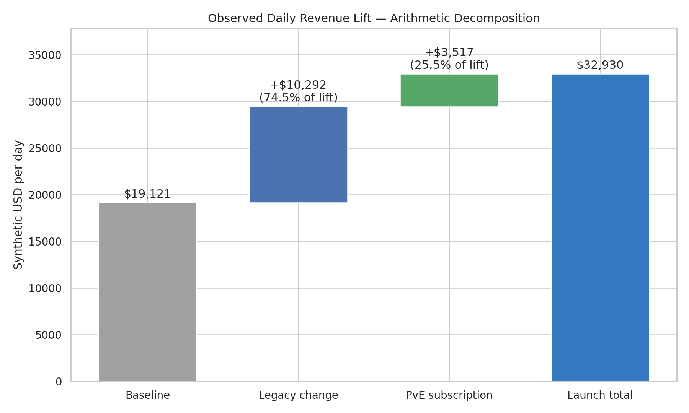
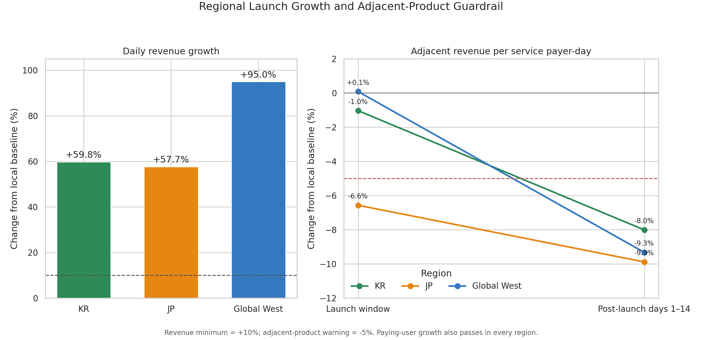

# Analysis 4: Revenue Growth and Subscription Value

Launch evaluated: PvE Growth Subscription, released May 15, 2025

## Quick Summary

> Revenue and daily paying users increased sharply around the subscription
> launch, but the new product supplied only 25.5% of the arithmetic revenue
> lift. After accounting for the larger daily payer base, adjacent offers
> weakened after the launch. The result is **Mixed: growth with a guardrail
> warning**, not proven incremental revenue.

## What This Analysis Answers

1. Did the launch window clear the revenue and paying-user growth thresholds?
2. How much of the observed revenue lift came from the new subscription?
3. Did adjacent recurring and progression offers weaken around the launch?
4. Did the result differ by region or create retention and concentration risks?

> **Analysis boundary:** The data contains aggregate daily sales at list price,
> not buyer-level transactions. It does not identify repeat buyers, product
> switching, refunds, taxes, discounts, or net revenue. The analysis can detect
> a portfolio warning, but it cannot prove product incrementality or individual
> customer cannibalization.

## Method at a Glance

| Rule | How it is applied |
|---|---|
| Source sales grain | Date × region × product |
| Local baseline | April 15–May 14, 2025; immediate pre-launch comparison |
| Launch window | May 15–June 14, 2025; first 31 available calendar days |
| Post-launch check | June 15–28, 2025; delayed adjacent-product warning |
| Historical context | February 2025; cleaner event context but different service scale |
| Primary thresholds | Daily revenue +10%; daily paying users +5% |
| Adjacent-product warning | Revenue per service payer-day declines by 5% or more |
| Retention guardrail | May–June cohort-context D30 declines by 1 pp or more versus February |
| Revenue bridge | Baseline revenue + legacy-product change + new-subscription revenue = launch revenue |

`Revenue per service payer-day` divides product revenue by the sum of all daily
paying users in the service. It is not revenue per buyer of that product and is
not deduplicated period average revenue per paying user (ARPPU).

The local baseline overlaps a designed content gap and early recovery, making
it operationally relevant but weak as a causal counterfactual. February is a
secondary reference, not a control group.

Complete formulas and decision thresholds are documented in the
[Analysis Specification](../analysis_spec.md).

## 1. Headline Growth Around Launch

| Metric | Local baseline | Launch window | Change | Decision rule |
|---|---:|---:|---:|---:|
| Revenue per day | $19,121 | $32,930 | +72.21% | +10% |
| Paying users per day | 2,048 | 2,952 | +44.16% | +5% |
| DAU-weighted conversion rate | 2.68% | 3.54% | +32.12% | Diagnostic |
| Revenue per service payer-day | $9.34 | $11.15 | +19.46% | Diagnostic |

The two diagnostic rows have no pass/fail thresholds. They provide context for
the revenue and paying-user growth decisions rather than additional success
criteria.

### Finding

Both primary growth thresholds pass. However, launch-window revenue remains
40.41% below February. The +72.21% headline therefore describes a rebound from
the immediate local baseline, not a return to the earlier revenue level.

### Decision Relevance

The launch coincides with meaningful commercial improvement, but the baseline
is too weak to assign the full service-level increase to the subscription.
Product contribution must be separated from the surrounding catalog recovery.

## 2. Arithmetic Revenue Bridge

### At a Glance

The bridge starts with baseline daily revenue, adds the change in all existing
products, and then adds revenue booked to the new subscription. The components
reconcile exactly to launch-window daily revenue. This is accounting arithmetic,
not a causal estimate.

| Component | Revenue per day | Share of observed lift |
|---|---:|---:|
| Local-baseline total | $19,121 | — |
| Legacy-product change | +$10,292 | 74.53% |
| New PvE subscription | +$3,517 | 25.47% |
| Launch-window total | $32,930 | — |

### Finding

The subscription represents 10.68% of launch-window revenue and 25.47% of the
arithmetic lift from the local baseline. Most of the observed increase appears
in the existing product catalog.

### Decision Relevance

The service-level +72.21% result cannot be presented as the subscription's
incremental impact. The defensible statement is narrower: the product added
booked revenue while the broader catalog supplied most of the measured rebound.

## 3. Adjacent-Product Guardrail

### At a Glance

Bars show change from the local baseline in revenue per service payer-day.
Blue covers the launch window, orange the following 14 days, and the dashed
line marks the -5% warning threshold. The adjacent set is defined in advance as
the Monthly Mission Pass, 30-Day Premium Currency Pass, and Account Growth
Booster because they share recurring or progression-oriented value with the
new subscription.

| Product | Launch window | Post-launch days 1–14 | Guardrail result |
|---|---:|---:|---|
| Monthly Mission Pass | -0.14% | -6.49% | Delayed warning |
| 30-Day Premium Currency Pass | -4.45% | -12.56% | Delayed warning |
| Account Growth Booster | -7.24% | -13.24% | Immediate and persistent warning |
| Combined adjacent set | -3.09% | -9.89% | Combined warning appears after launch |

### Finding

The Account Growth Booster is the only adjacent product to breach the guardrail
during the launch window, making it the first product-level diagnostic
priority. In the next 14 days, all three products and the combined set cross
the warning line. At the same time, absolute adjacent revenue per day remains
21.71% above baseline because the service has more daily payers.

### Decision Relevance

The pattern is consistent with weaker revenue allocation to adjacent products,
but it is not proof that the same customers switched offers. A larger influx of
subscription-only payers, changes in purchase timing, and catalog recovery can
also lower adjacent revenue per service payer-day.

## 4. Regional and Quality Guardrails

### At a Glance

The left panel compares daily revenue growth by region. The right panel follows
each region's combined adjacent-product metric from the launch window into the
next 14 days. Region colors remain consistent with the rest of the portfolio.

| Region | Daily revenue | Daily paying users | Adjacent launch | Adjacent post-14 | D30 change | Warning status |
|---|---:|---:|---:|---:|---:|---|
| KR | +59.78% | +36.81% | -1.04% | -8.01% | +0.97 pp | Delayed warning |
| JP | +57.70% | +31.63% | -6.57% | -9.89% | +0.29 pp | Immediate and persistent warning |
| Global West | +94.96% | +58.31% | +0.08% | -9.33% | -0.38 pp | Delayed warning |

### Finding

Revenue and daily paying users clear their growth thresholds in every region.
JP is the only region with an immediate combined adjacent-product warning, and
all three regions cross the warning line during the post-launch check.

The pooled May–June D30 change is +0.09 pp; every regional result remains above
the -1 pp failure guardrail. These are monthly service-cohort contexts, not
subscription-buyer retention. The May cohort also contains players acquired
before the May 15 launch.

Global West records the weakest regional D30 result at -0.38 pp. It does not
breach the failure guardrail, but the difference from KR's +0.97 pp makes it the
first region for follow-up retention monitoring rather than evidence of a
service-wide retention failure.

### Decision Relevance

The delayed adjacent-product decline is a shared portfolio issue, while JP
deserves earlier investigation because its warning appears during the launch
window itself. Retention does not add a failure signal, but its monthly grain
is too coarse to validate subscription renewal or buyer quality.

## Secondary Concentration Check

Product-revenue concentration decreases: the Herfindahl–Hirschman Index (HHI)
moves from 0.1410 to 0.1259, and the top-three product share moves from 53.62%
to 50.17%. In plain terms, launch-window revenue is spread more broadly across
the catalog.

This is only a secondary check. Adding a new revenue-bearing product can lower
concentration mechanically, so the decline is not evidence that the
subscription created incremental value.

## What Is Established

- Daily revenue and paying users clear the authored launch thresholds.
- The new subscription supplies 25.47% of the arithmetic revenue lift.
- The combined adjacent set stays above its warning line during launch but
  falls 9.89% per service payer-day in the following 14 days.
- JP shows the earliest regional adjacent-product warning; all regions show a
  delayed warning.
- May–June service-cohort D30 retention stays inside the failure guardrail.
- Product concentration decreases, but the result is descriptive and partly
  influenced by adding another product.

## What Remains Unresolved

- Aggregate product totals cannot identify buyer overlap, switching, renewal,
  or changes in total spend for the same person.
- The local baseline cannot separate product impact from content-gap recovery
  or other time-varying service conditions.
- Revenue at list price does not represent net revenue after refunds, taxes,
  discounts, or platform fees.
- Monthly acquisition cohorts cannot isolate subscription buyers or exact
  post-purchase retention.
- The analysis does not distinguish fixed payer budgets, benefit overlap,
  launch messaging, or repeat-purchase timing as mechanisms.

## Analysis 4: Decision and Next Step

The subscription launch is **Mixed: growth with a guardrail warning**. Retaining
the product while instrumenting buyer-level overlap, migration, renewal, and
total spend is more defensible than either declaring full incrementality or
removing the product immediately. JP and the Account Growth Booster are the
first diagnostic priorities.

Analysis 5 evaluates whether the later infrastructure incident creates a
separate commercial recovery problem. Its impact should not be used to explain
away the adjacent-product warning already visible before the outage.
