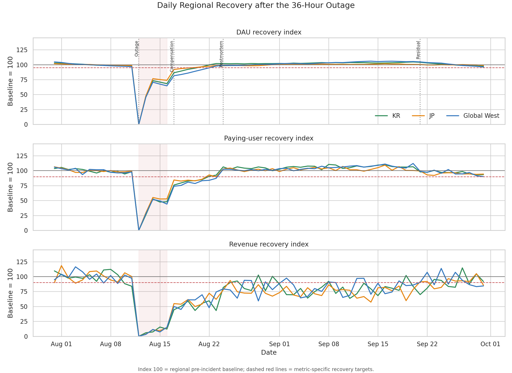
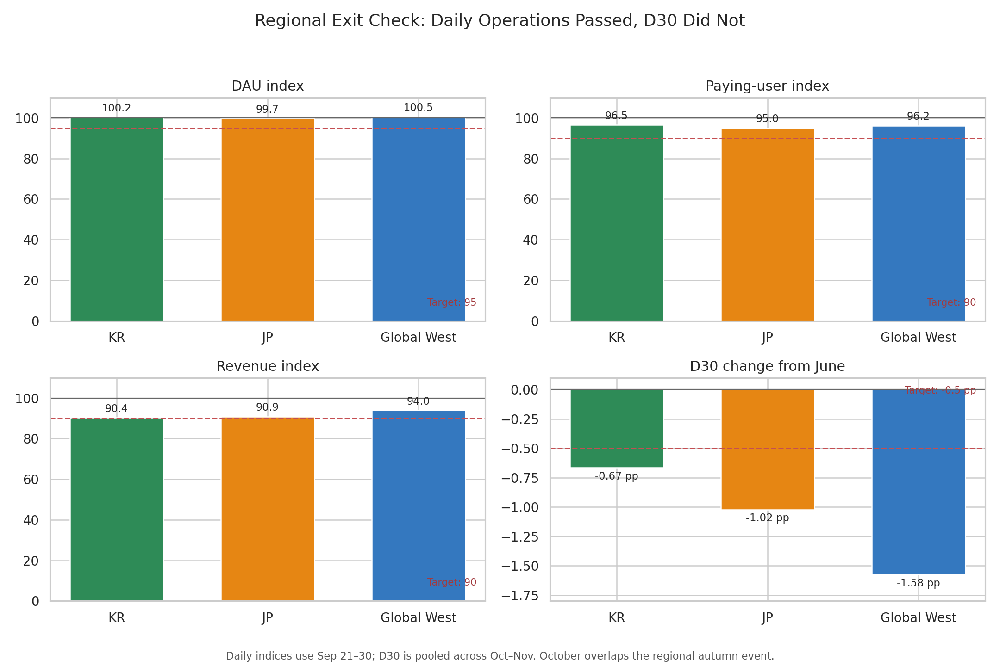
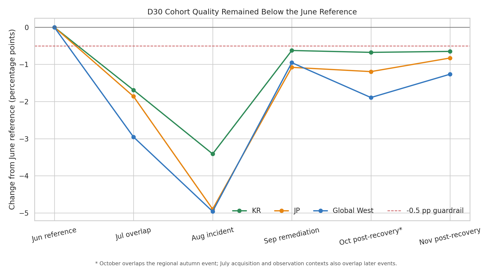

# Analysis 5: Service Recovery and Residual Cohort Gap

Incident evaluated: 36-hour infrastructure outage beginning August 12, 2025

## Quick Summary

> Service availability recovered first, followed by activity and then revenue.
> Extraordinary compensation brought returned users to 293.95% of baseline,
> while revenue reached only 56.19%. Daily operational metrics eventually
> cleared their targets in every region, but October–November D30 retention
> remained 1.23 percentage points below the June reference. The result is
> **Mixed: operational recovery, retention gap remains**.

## What This Analysis Answers

1. How quickly did service availability, DAU, paying users, and revenue recover?
2. Did extraordinary compensation restore commercial activity as quickly as it
   brought players back?
3. Did every region clear the daily operational exit thresholds?
4. Did post-recovery cohorts return to the pre-incident D30 guardrail?

> **Analysis boundary:** Daily service totals and monthly acquisition cohorts
> cannot identify individual compensation claims, purchase journeys, or player
> sentiment. October also overlaps a regional autumn event. The analysis can
> distinguish operational recovery from a remaining cohort-quality gap, but it
> cannot estimate the outage's causal effect on trust or retention.

## Method at a Glance

| Rule | How it is applied |
|---|---|
| Source activity grain | Date × region |
| Daily baseline | July 31–August 11, 2025; 12 clean pre-incident days |
| Recovery index | Stage KPI ÷ regional baseline KPI × 100 |
| Operational exit targets | DAU ≥95; paying users ≥90; revenue ≥90 |
| D30 reference | June 2025; latest cohort fully observed before the outage |
| D30 guardrail | No worse than -0.5 pp from the June reference |
| Post-recovery daily check | September 21–30; ends before the October event |
| Post-recovery cohort check | October–November pooled, with each month also checked separately |
| Reported outflow | Secondary diagnostic; no pass/fail threshold |

All targets are authored portfolio rules, not industry benchmarks. Daily
operational recovery requires DAU, paying users, and revenue to pass together.
D30 is evaluated separately because a restored service can still acquire or
retain lower-quality cohorts.

During the full outage, `user_outflow = 0` means that outflow is unobservable
while players cannot connect. It does not mean that no latent attrition occurs.

Complete formulas and window definitions are documented in the
[Analysis Specification](../analysis_spec.md).

## 1. Recovery Sequence after the Outage

### At a Glance

Each line compares a region with its own pre-incident baseline, where 100 means
the baseline level. The dashed red line in each panel is that metric's recovery
target. The shaded interval covers the full outage, partial restoration, and
delayed-response stages.

| Stage | Availability | DAU index | PU index | Revenue index | Result |
|---|---:|---:|---:|---:|---|
| Full outage | 0% | 0.00 | 0.00 | 0.00 | Incomplete |
| Partial restoration | 50% | 46.19 | 27.43 | 4.05 | Incomplete |
| Delayed response | 82% | 70.43 | 49.91 | 11.50 | Incomplete |
| Extraordinary compensation | 100% | 92.21 | 82.85 | 56.19 | Incomplete |
| Postmortem and remediation | 100% | 102.04 | 104.42 | 79.20 | Incomplete |
| Residual post-recovery | 100% | 100.24 | 95.96 | 92.01 | Thresholds met |

`Incomplete` means that at least one operational target remains unmet; it does
not mean that every metric is below baseline.

### Finding

The service reaches full availability before any behavioral or commercial
stage clears all three operational targets. During remediation, DAU and paying
users exceed baseline, but revenue remains at 79.20. Revenue is the final daily
metric to recover, clearing its target only in the September 21–30 window.

### Decision Relevance

Availability alone is not an adequate incident-close criterion. Separate
technical, activity, and commercial checkpoints would have kept the incident
open after access was restored and exposed the slower revenue recovery.

## 2. Reactivation Outpaced Commercial Recovery

### At a Glance

The chart focuses on the three stages that follow the initial restoration.
Returned users measure daily reactivation, not unique compensation claimants.
Paying users and revenue show whether that return translated into commercial
activity.

| Stage | Returned users | Paying users | Revenue | Revenue per service payer-day |
|---|---:|---:|---:|---:|
| Extraordinary compensation | 293.95 | 82.85 | 56.19 | 67.82 |
| Postmortem and remediation | 149.58 | 104.42 | 79.20 | 75.85 |
| Residual post-recovery | 100.06 | 95.96 | 92.01 | 95.89 |

`Revenue per service payer-day` divides total stage revenue by the sum of daily
paying users. It is not revenue per compensation claimant and is not a
deduplicated period ARPPU.

### Finding

Compensation produces a sharp return spike without comparable paying-user or
revenue recovery. During remediation, paying users rise above baseline while
revenue per service payer-day remains at 75.85, showing that payer counts recover
before average daily commercial value. The gap narrows only in the final daily
window.

### Decision Relevance

The pattern is consistent with players returning for a high-value free reward
before normal spending resumes, but the aggregate data cannot prove that
journey. User-level entitlement claim, return, and purchase events are required
before treating compensation as the mechanism.

## 3. Regional Operational Exit Check

### At a Glance

The first three panels compare each region's September 21–30 daily recovery
indices with their metric-specific targets. The fourth compares pooled
October–November D30 with the -0.5 pp guardrail. Bars above the dashed line pass
in the operational panels; D30 bars below the dashed line fail.

| Region | DAU index | PU index | Revenue index | Outflow index (baseline = 100) | Oct–Nov D30 change | D30 guardrail result |
|---|---:|---:|---:|---:|---:|---|
| KR | 100.25 | 96.52 | 90.36 | 105.30 | -0.67 pp | Failed by 0.17 pp |
| JP | 99.71 | 95.00 | 90.88 | 106.15 | -1.02 pp | Failed by 0.52 pp |
| Global West | 100.52 | 96.15 | 93.99 | 103.98 | -1.58 pp | Failed by 1.08 pp |

### Finding

Every region clears all three daily operational targets. Post-recovery outflow
remains 3.98%–6.15% above baseline, but this metric is a supporting warning
rather than a formal failure rule. The final Mixed classification is driven by
the D30 guardrail after daily operations pass.

### Decision Relevance

The technical and commercial response can remain global because every region
follows the same broad recovery sequence. Global West deserves the first
retention follow-up because its post-recovery D30 gap is the largest, not
because its daily operational recovery is the weakest.

## 4. Cohort Quality after Service Recovery

### At a Glance

The chart compares each monthly acquisition cohort with June, the latest D30
cohort fully observed before the outage. July is shown but is not the reference:
its acquisition context includes Astra, and its D30 observation overlaps the
incident. October overlaps the regional autumn event; November has no planned
event overlap.

| Cohort context | Global D30 | Change from June | Guardrail |
|---|---:|---:|---|
| June reference | 8.52% | — | Reference |
| July overlap | 6.09% | -2.43 pp | Failed |
| August incident | 3.94% | -4.58 pp | Failed |
| September remediation | 7.61% | -0.91 pp | Failed |
| October post-recovery* | 7.10% | -1.42 pp | Failed |
| November post-recovery | 7.48% | -1.04 pp | Failed |
| October–November pooled | 7.29% | -1.23 pp | Failed |

\* October overlaps the regional autumn event.

### Finding

Retention is already weak in July, so the August low cannot be assigned to the
outage alone. September improves, but both October and November independently
fail the -0.5 pp guardrail in every region. Pooling the two months improves
stability; it does not turn them into a clean incident-only comparison.

### Decision Relevance

The cross-context result supports a remaining cohort-quality gap after daily
operations recover. It does not prove that the outage caused the full gap, nor
does it directly measure lost or restored player trust.

## What Is Established

- Service availability recovers before activity and commercial KPIs.
- Compensation raises returned users to 293.95% of baseline while revenue
  reaches only 56.19%.
- Revenue is the final daily operational metric to clear its target.
- Every region passes the September 21–30 operational exit check.
- October and November D30 each fail the guardrail in every region; the pooled
  post-recovery gap is -1.23 pp globally.
- Reported post-recovery outflow remains above baseline as a secondary warning.

## What Remains Unresolved

- Aggregate daily data cannot connect compensation claims, return behavior,
  purchases, and later retention for the same player.
- Retention is already below the June reference before the outage, limiting
  incident-only attribution.
- October's seasonal-event overlap prevents a clean event-free two-month
  post-recovery comparison.
- The data does not observe support contacts, communication exposure, player
  sentiment, refunds, or net revenue.
- Elevated outflow and lower D30 are behavioral proxies, not direct measures of
  player trust.

## Analysis 5: Decision and Next Step

The incident outcome is **Mixed: operational recovery, retention gap remains**.
The service can exit the daily incident-response phase after September 30, but
cohort monitoring should remain open. The next instrumentation priority is a
player-level compensation claim → return → purchase → D30 path, paired with
communication exposure and support-contact data.

Analysis 6 translates the shared warnings and regional differences across all
five analyses into prioritized global, KR, JP, and Global West actions.
