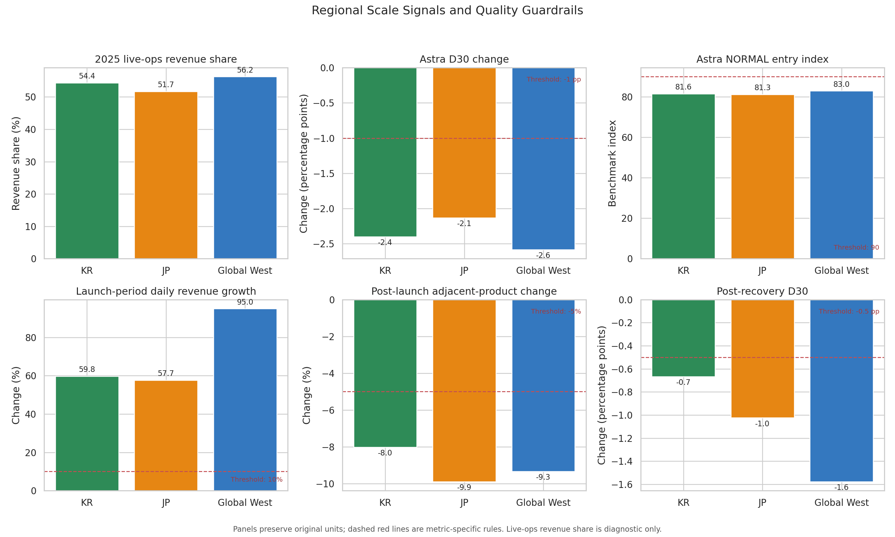

# Analysis 6: Overall Findings and Final Recommendations

Final summary of shared findings and regional priorities across Analyses 1–5

## Quick Summary

> All three regions share three problems: Astra underperforms in D30 and core
> PvE entry, adjacent recurring offers weaken after the subscription launch,
> and post-recovery D30 remains below its guardrail. Regional execution should
> still differ. KR needs an acquisition-recovery diagnostic, JP has the only
> immediate adjacent-product warning, and Global West combines the strongest
> scale response with the weakest durability. The strategy is **one shared
> measurement and product layer, followed by three regional action paths**.

## What This Analysis Answers

1. Which findings require a global response because every region fails?
2. Which signals are unique or clearly worst in one region?
3. Which regional strengths should be preserved while risks are addressed?
4. What execution sequence follows from the five completed analyses?

> **Analysis boundary:** Revenue growth, retention percentage points,
> participation indices, and recovery indices use different units and
> baselines. They cannot be added into a defensible regional score without
> subjective weights. This synthesis preserves the original metrics and
> guardrails; it prioritizes decisions rather than ranking regions from best to
> worst.

## Method at a Glance

| Rule | How it is applied |
|---|---|
| Evidence sources | Analyses 1–5; no new causal model |
| Shared priority | The same defined guardrail fails in all three regions |
| Local priority | A unique failure or clearly worst result supported by related evidence |
| Regional strength | A positive or comparatively stronger result retained beside each risk |
| Action order | Missing instrumentation and reversible tests before broad product or acquisition changes |
| Composite score | Deliberately excluded because the source metrics are not commensurable |

The synthesis uses the same KR green, JP orange, and Global West blue convention
as the earlier analyses. Thresholds remain authored portfolio rules rather than
industry benchmarks.

Complete definitions are documented in the
[Analysis Specification](../analysis_spec.md).

## 1. Cross-Analysis Regional Evidence

### At a Glance

Each panel retains its original unit and, where applicable, its original dashed
decision line. The chart intentionally does not normalize unlike measures into
one score. Live-ops revenue share is a comparative diagnostic with no pass/fail
threshold.

| Region | 2025 live-ops revenue share | Fantasy D30 | Astra D30 | Astra entry index | Launch revenue growth | Post-14 adjacent change | Post-recovery D30 |
|---|---:|---:|---:|---:|---:|---:|---:|
| KR | 54.36% | +2.37 pp | -2.40 pp | 81.57 | +59.78% | -8.01% | -0.67 pp |
| JP | 51.71% | +3.79 pp | -2.13 pp | 81.29 | +57.70% | -9.89% | -1.02 pp |
| Global West | 56.25% | +2.64 pp | -2.58 pp | 82.97 | +94.96% | -9.33% | -1.58 pp |

### Finding

Global West shows the strongest launch-revenue response and the highest
live-ops revenue share, but it also records the weakest Astra and post-recovery
D30 results. JP produces the strongest Fantasy cohort quality, while KR has the
smallest post-recovery D30 gap. No region is uniformly strongest or weakest.

### Decision Relevance

Scale and durability must remain separate decision dimensions. A large revenue
response does not cancel a retention failure, and a comparatively stronger D30
result does not remove a guardrail breach.

## 2. Shared Warnings and the JP-Specific Launch Signal

### At a Glance

Color indicates pass or warning status, while each cell retains the underlying
value. Four guardrails fail in all three regions. The launch-window
adjacent-product check is the only one that separates JP from KR and Global
West.

| Guardrail | Pass rule | KR | JP | Global West |
|---|---:|---|---|---|
| Astra D30 quality | ≥ -1 pp | Warning | Warning | Warning |
| Astra NORMAL entry | ≥90 | Warning | Warning | Warning |
| Launch adjacent-product change | ≥ -5% | Pass | Warning | Pass |
| Post-launch adjacent-product change | ≥ -5% | Warning | Warning | Warning |
| Post-recovery D30 | ≥ -0.5 pp | Warning | Warning | Warning |
| Post-incident daily operations | DAU ≥95; PU ≥90; revenue ≥90 | Pass | Pass | Pass |

October contributes to the pooled post-recovery D30 check but overlaps the
regional autumn event. November has no planned-event overlap, and both months
also fail independently in every region. The pooled result is therefore a
cross-context quality check, not an incident-only causal estimate.

### Finding

Three connected problems require global ownership:

1. **Event-to-core-content bridge:** Astra D30 and NORMAL boss entry fail in
   every region, while participant completion remains comparable in Analysis 3.
   At NORMAL difficulty, the regional entry indices cluster within a narrow
   81.29–82.97 range. Combined with the similar shortfall across difficulties
   in Analysis 3, this supports a service-wide pre-entry problem rather than a
   region-specific combat issue.
2. **Recurring-offer protection:** every region develops a delayed
   adjacent-product warning, although only JP crosses the line during launch.
3. **Recovery exit criteria:** daily operations pass everywhere, but
   post-recovery D30 does not.

### Decision Relevance

These are not three isolated regional failures. Shared instrumentation, product
rules, and recovery criteria should be designed once, then adapted to the
distinct regional signals below.

## 3. Shared Priority Plan

| Priority | Theme | Action | Evidence boundary |
|---|---|---|---|
| P0-1 | Event-to-core bridge | Instrument exposure → eligibility → boss page → first attempt; then test progression support and reward communication. | Aggregates locate the break before entry but cannot separate unlock friction, perceived power requirements, or reward appeal. |
| P0-2 | Recurring-offer protection | Separate the PvE subscription's value proposition from the growth booster and currency pass; track buyer-level migration and renewal. | Product totals show revenue-allocation warnings, not individual switching. |
| P0-3 | Incident exit criteria | Maintain technical, activity, commercial, and mature-cohort checks in one recovery protocol. | Retention, outflow, and payer behavior are proxies rather than direct measures of trust. |

### Finding

All three P0 actions begin with missing user-level evidence or explicit
guardrails. This keeps the first response reversible and measurable rather than
jumping directly to difficulty changes, product removal, or more acquisition
spend.

## 4. Regional Action Paths

### KR — Restore Acquisition with Quality Gates

> KR has the weakest post-recovery new-user flow, but the closest D30 recovery
> and the strongest subscription-period D30 result.

- The post-recovery NRU index is 86.20, the weakest regional result and 13.80%
  below its own baseline. NRU has no formal recovery threshold in this project.
- Post-recovery D30 is -0.67 pp, closest to the -0.5 pp guardrail but still a
  failure.
- Subscription-period D30 is +0.97 pp, the strongest regional result.
- Adjacent-product change moves from -1.04% during launch to -8.01% afterward.

**P1:** Diagnose channel, campaign, and onboarding recovery before restoring
broad traffic spend; gate expansion on D7/D30 and first-boss-entry quality.

**P2:** Examine renewal timing and payer-level overlap because KR's
adjacent-product warning appears after launch rather than immediately.
The shared P0-2 response already covers this delayed warning; it remains a
regional P2 because KR does not show JP's unique launch-window failure.

**Strength to preserve:** KR's comparatively stronger cohort-quality results
should not be traded away for faster volume recovery.

### JP — Clarify Recurring-Offer Positioning

> JP has the strongest successful-collaboration retention response and the only
> immediate adjacent-product warning at subscription launch.

- Fantasy D30 improves by +3.79 pp, the strongest regional result.
- Launch-window adjacent-product change is -6.57%, the only immediate regional
  failure, and reaches -9.89% in the next 14 days.
- Post-recovery outflow is highest at 106.15, while D30 remains -1.02 pp.
- Its 2025 live-ops revenue share is the lowest of the three at 51.71%.

**P1:** Test benefit differentiation, placement, and messaging between the PvE
subscription and existing recurring offers. Aggregate totals do not prove that
the same buyers substituted one product for another.

**P2:** Pair paying-user recovery with outflow and mature-cohort monitoring
instead of treating recovered payer counts as sufficient.

**Strength to preserve:** Offer redesign should retain JP's demonstrated
ability to convert a well-matched collaboration into durable cohorts.

### Global West — Put Durability Gates on Scale

> Global West generates the largest scale response but repeatedly records the
> weakest long-term quality.

- Launch-period daily revenue grows by 94.96%, the strongest regional result.
- Live-ops days account for 56.25% of 2025 revenue, the highest regional share;
  live-ops mean daily revenue is 186.67% above quiet-day revenue.
- Astra D30 falls by 2.58 pp, the weakest collaboration-quality result.
- Post-recovery D30 falls by 1.58 pp, also the weakest regional result.
- Launch adjacency is initially stable at +0.08% before falling to -9.33% in
  the next 14 days.

**P1:** Require D30, core-content entry, and post-event persistence gates before
expanding acquisition or repeating scale-heavy campaigns.

**P2:** Build stronger quiet-period progression value and monitor event-to-quiet
revenue decay.

**Strength to preserve:** Global West's monetization responsiveness remains the
largest upside; the goal is to improve durability without suppressing response.

## 5. Shared Versus Local Decision Matrix

| Decision area | Global response | KR emphasis | JP emphasis | Global West emphasis |
|---|---|---|---|---|
| Astra funnel | Repair pre-entry journey; do not begin with broad difficulty nerfs | Diagnose acquisition and onboarding quality | Clarify entry and reward communication | Connect acquisition scale to first attempt |
| Subscription launch | Track buyer migration and reduce catalog overlap | Investigate delayed renewal overlap | Test immediate offer positioning | Preserve launch upside; monitor delayed warning |
| Incident recovery | Keep mature-cohort exit criteria | Restore new-user flow with quality gates | Monitor elevated outflow and D30 | Prioritize D30 durability |
| Live-ops model | Track quiet-period health | Maintain balanced cadence | Preserve comparatively lower concentration | Diagnose highest revenue concentration |

Evidence trail: Astra funnel (§1–2 and §4), subscription overlap (§2 and §4),
incident recovery (§2 and §4), and live-ops concentration (§1 and §4).

## 6. Recommended Execution Sequence

1. Add the shared user-level telemetry and recovery guardrails before running
   additional regional campaigns.
2. Run the JP offer-positioning test and KR acquisition diagnostic in parallel
   with the global Astra entry audit.
3. Require Global West acquisition plans to include D30 and post-event
   persistence gates.
4. Re-evaluate after at least two mature cohorts and one complete subscription
   renewal cycle.

The sequence prioritizes missing evidence and reversible tests before broad
content, pricing, or acquisition changes.

## What Is Established

- Astra D30, Astra NORMAL entry, delayed adjacent-product performance, and
  post-recovery D30 fail their guardrails in every region.
- JP is the only region with an immediate launch-window adjacent-product
  warning.
- KR has the weakest post-recovery NRU result but comparatively stronger D30
  outcomes.
- Global West combines the strongest revenue response with the weakest Astra
  and post-recovery D30 results.
- Daily incident exit thresholds pass in all three regions.

## What Remains Unresolved

- Aggregate data cannot identify buyer migration, renewal, compensation-claim
  journeys, or individual event-to-boss funnels.
- KR's NRU weakness does not identify the responsible acquisition channel,
  campaign, or onboarding step.
- Live-ops revenue concentration does not establish that event cadence caused
  weak quiet-period health or retention.
- October event overlap and pre-incident retention weakness limit causal
  interpretation of post-recovery D30.
- The analysis does not observe marketing cost, contribution margin, player
  sentiment, or regional operating constraints.

## Portfolio-Level Decision

The service can generate traffic, paying-user growth, and event revenue, but it
does not consistently convert that scale into durable behavior. The repeated
failure occurs at three handoffs: awareness to core-content entry, new-product
growth to adjacent-offer stability, and technical restoration to cohort
recovery.

The recommended operating model is therefore shared instrumentation and
guardrails first, followed by regional execution: restore qualified acquisition
in KR, clarify recurring-product positioning in JP, and place durability gates
on Global West's growth potential.
